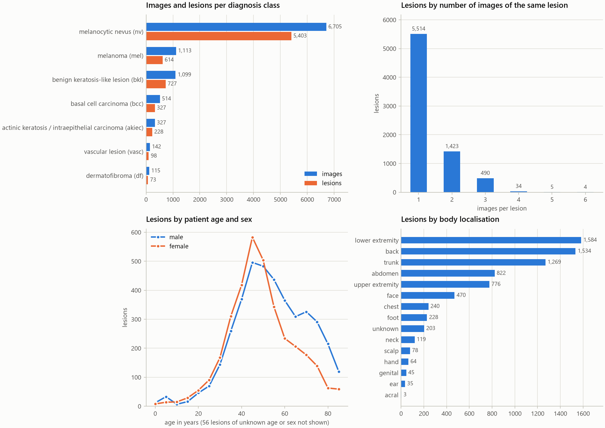
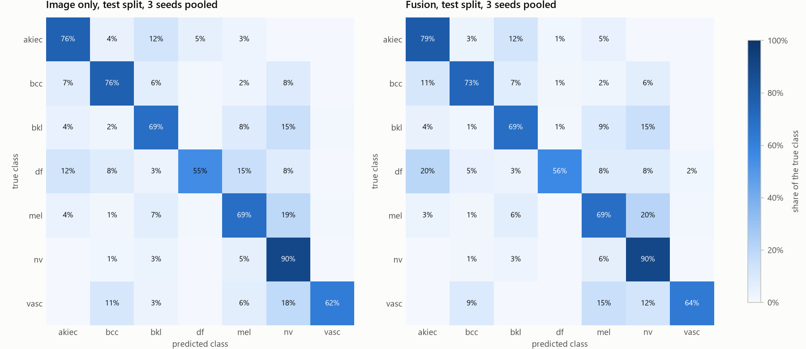
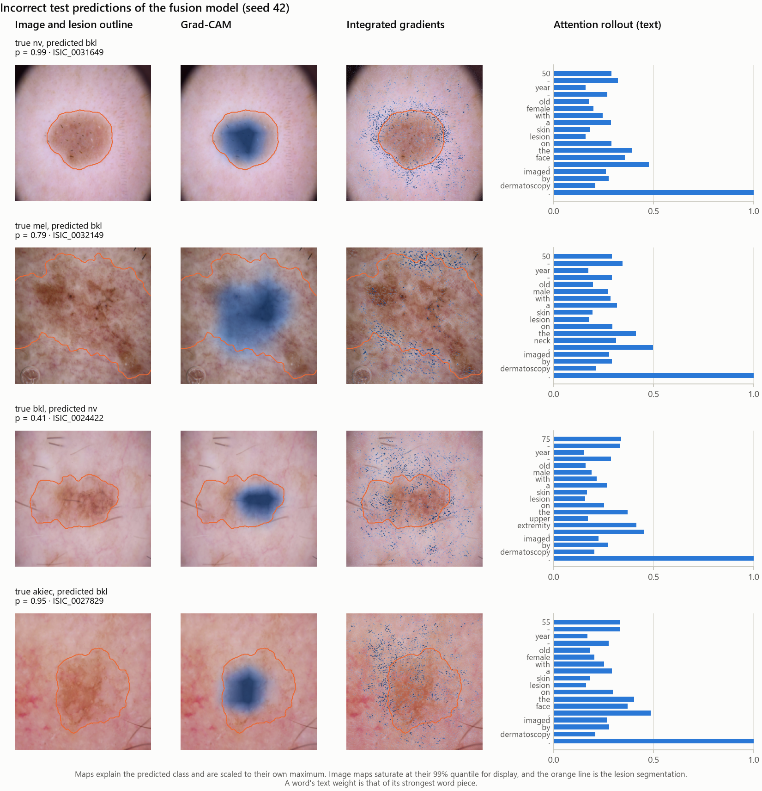
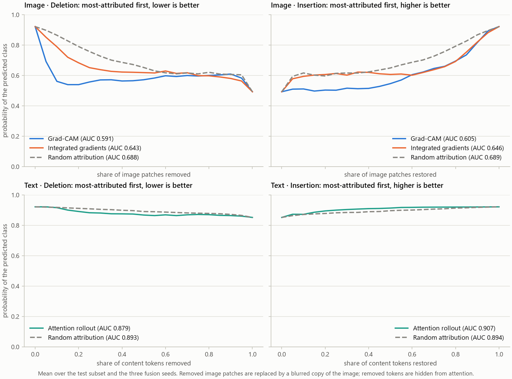
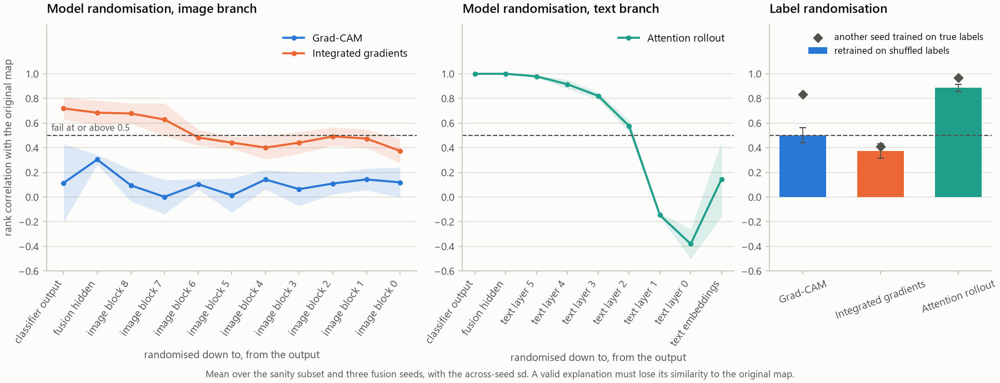
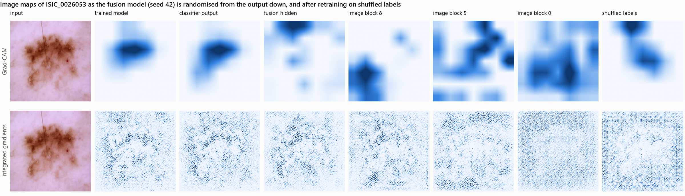
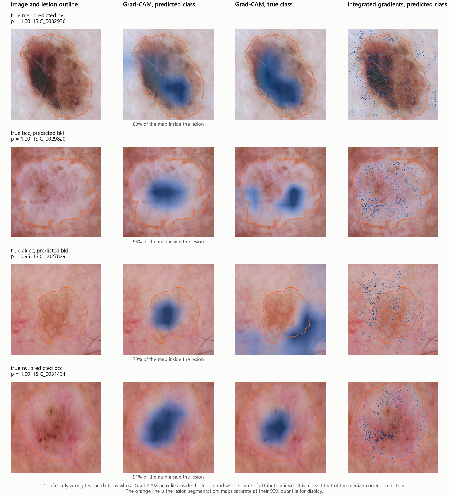
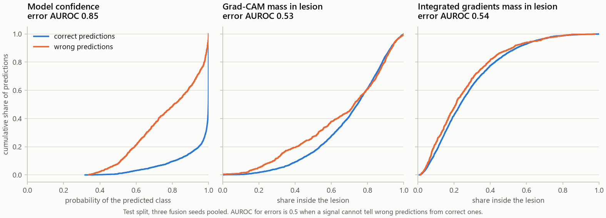

# ExplainMed-XAI

Multimodal skin-lesion classification on HAM10000 where the explanations are **measured, not
illustrated**. Grad-CAM and integrated gradients on the image branch, and attention rollout on the
text branch, are scored with faithfulness metrics (deletion and insertion AUC against a
random-attribution control, sparsity, localisation, inter-method agreement) and put through the
Adebayo et al. model- and label-randomisation sanity checks. A method that fails a check is
reported as failing.

> [!WARNING]
> **Not a diagnostic tool.** This is a research artefact for studying whether saliency
> explanations can be trusted. It has not been clinically validated, must not be used to make or
> support decisions about any patient, and nothing it outputs is a diagnosis.

> [!IMPORTANT]
> **The text modality is synthetic.** HAM10000 contains no clinical notes. The "text" input is a
> sentence built by a fixed template from the dataset's structured metadata (age, sex, lesion
> localisation), for example *"45-year-old male with a skin lesion on the back, imaged by
> dermatoscopy."* It is not real clinical documentation, and results on it say nothing about how a
> model would behave on genuine clinical notes. See [`reports/text_examples.md`](reports/text_examples.md).

## The problem

Saliency maps are routinely shown next to medical image predictions, as if a heatmap on the lesion
justified the diagnosis. Whether a map reflects what the model computed, rather than what a reader
expects to see, is rarely checked. This repo trains a multimodal skin-lesion classifier and then
evaluates its explanations the way one would evaluate a model: against a control, with sanity checks
that a valid explanation must pass, and on the model's own errors.

## Results at a glance

Test split, mean ± sd over three training seeds ([`reports/results.csv`](reports/results.csv)):

| Model      |        Macro-F1 | Balanced accuracy | Melanoma recall |
| ---------- | --------------: | ----------------: | --------------: |
| Image only | 0.7124 ± 0.0235 |   0.7096 ± 0.0205 | 0.6905 ± 0.0273 |
| Text only  | 0.2266 ± 0.0061 |   0.3206 ± 0.0085 | 0.1687 ± 0.0656 |
| Fusion     | 0.7216 ± 0.0111 |   0.7146 ± 0.0062 | 0.6885 ± 0.0034 |

| Explanation method   | vs random: deletion / insertion | Model randomisation | Label randomisation |
| -------------------- | ------------------------------- | ------------------- | ------------------- |
| Grad-CAM             | better / worse                  | passes              | **fails**           |
| Integrated gradients | better / worse                  | **fails**           | passes              |
| Attention rollout    | better / better                 | **fails**           | **fails**           |

- **No explanation method passes every check.** Attention rollout fails both sanity checks,
  integrated gradients fails model randomisation, and Grad-CAM fails label randomisation narrowly.
- **Explanations do not flag errors.** How well Grad-CAM's map sits on the lesion separates wrong
  from correct predictions at an AUROC of 0.53, against 0.85 for the model's own confidence.
- **Confident errors come with plausible maps.** 47% of predictions that are wrong with a probability
  of at least 0.9 have a Grad-CAM map as well placed as a typical correct one. That includes
  melanomas called benign moles with near certainty.
- **The synthetic text adds nothing measurable.** Fusion matches the image-only model within seed
  noise.

Every result in this README is produced by a script in this repo and written to
[`reports/`](reports/).

## Dataset

[HAM10000](https://doi.org/10.7910/DVN/DBW86T): 10,015 dermatoscopic images of 7,470 distinct
lesions across seven diagnostic classes, with a metadata CSV giving age, sex, lesion localisation,
and how the diagnosis was established.

| Class                                                   | Images | Lesions | Share of images |
| ------------------------------------------------------- | -----: | ------: | --------------: |
| melanocytic nevus (`nv`)                                |  6,705 |   5,403 |           66.9% |
| melanoma (`mel`)                                        |  1,113 |     614 |           11.1% |
| benign keratosis-like lesion (`bkl`)                    |  1,099 |     727 |           11.0% |
| basal cell carcinoma (`bcc`)                            |    514 |     327 |            5.1% |
| actinic keratosis / intraepithelial carcinoma (`akiec`) |    327 |     228 |            3.3% |
| vascular lesion (`vasc`)                                |    142 |      98 |            1.4% |
| dermatofibroma (`df`)                                   |    115 |      73 |            1.1% |

Two properties of this dataset shape everything downstream:

- **It is severely imbalanced.** Two thirds of the images are melanocytic nevi, so a model that
  always answers "nevus" is 67% accurate and useless. Results are reported as macro-F1, balanced
  accuracy, and per-class recall, never as accuracy alone.
- **`lesion_id` is not `image_id`.** 1,956 lesions (26%) were photographed more than once, and
  their 4,501 images make up 45% of the dataset. Images of the same lesion are near-duplicates.



The full tables behind the figure, including the class balance of each split, are in
[`reports/dataset_stats.csv`](reports/dataset_stats.csv), written by `scripts/inspect_data.py`.

Download the dataset and place it as:

```
data/raw/ham10000/HAM10000_metadata.csv
data/raw/ham10000/images/ISIC_*.jpg
data/raw/ham10000/segmentations/ISIC_*_segmentation.png
```

The segmentation masks are only needed by `make eval`, for the localisation metrics.

MIMIC-CXR was deliberately not used: it requires credentialed access, so nobody could rerun this
repo end to end.

## Splits are grouped by lesion

Train, validation, and test are split **by lesion, never by image**, stratified by diagnosis, with
a fixed seed. The lesion ids of each split are committed in
[`configs/splits.json`](configs/splits.json), and a test asserts that no lesion appears in two
splits.

| Split      | Lesions | Images |
| ---------- | ------: | -----: |
| Train      |   5,228 |  7,054 |
| Validation |   1,121 |  1,464 |
| Test       |   1,121 |  1,497 |

### What happens if you split by image instead

`scripts/leakage_demo.py` measures what the grouping is worth. It fine-tunes the same ImageNet
ResNet-18 with the same hyperparameters under two protocols: the lesion-grouped split, and a naive
split that stratifies by diagnosis but ignores `lesion_id`. Both splits are redrawn and the model
retrained under five seeds.

| Mean ± sd over 5 seeds                         |  Lesion-grouped | Naive image-level |  Naive − grouped |
| ---------------------------------------------- | --------------: | ----------------: | ---------------: |
| Accuracy                                       | 0.8493 ± 0.0084 |   0.8754 ± 0.0095 | +0.0261 ± 0.0101 |
| Balanced accuracy                              | 0.6989 ± 0.0254 |   0.7644 ± 0.0238 | +0.0655 ± 0.0178 |
| Macro-F1                                       | 0.7239 ± 0.0158 |   0.7860 ± 0.0208 | +0.0621 ± 0.0231 |
| Accuracy on single-image lesions (cannot leak) | 0.9207 ± 0.0085 |   0.9238 ± 0.0092 | +0.0032 ± 0.0032 |
| Accuracy on multi-image lesions                | 0.7627 ± 0.0222 |   0.8166 ± 0.0180 | +0.0539 ± 0.0235 |

The naive split scores higher on accuracy, balanced accuracy, and macro-F1 in all five seeds.
Accuracy is inflated by about 2.6 points, and the metrics that matter on an imbalanced problem by
more: about 6.5 points of balanced accuracy and 6.2 of macro-F1.

The last two rows locate the cause. Lesions photographed only once cannot leak under either
protocol, and on them the two splits differ by 0.3 points on average. The gap comes from lesions
photographed more than once: under the naive split an average of 535 of the 1,503 test images
(36%) have another image of the same lesion in the training set, and accuracy on multi-image
lesions rises by 5.4 points.

The naive numbers do not describe a better model. They describe the same model graded partly on
lesions it has already seen. Every other result in this repo uses the lesion-grouped split.

Seeds are fixed, and a rerun on the same machine reproduced both result files byte for byte.

Per-seed results are in [`reports/leakage_demo_runs.csv`](reports/leakage_demo_runs.csv) and the
summary above is [`reports/leakage_demo.csv`](reports/leakage_demo.csv). Reproduce both with
`make leakage-demo`.

## The text modality

Each image's metadata is turned into one templated sentence, for example *"65-year-old male with a
skin lesion on the face, imaged by dermatoscopy."* The template, its phrase tables, and examples
for every class are in [`reports/text_examples.md`](reports/text_examples.md), written by
`scripts/text_examples.py`. It is synthetic text, not clinical notes.

HAM10000 also records how each diagnosis was established (histopathology, follow-up, expert
consensus, or confocal microscopy). That field is **left out of the text** because it leaks the
label: every follow-up image is a nevus, every confocal image is a benign keratosis, and every
melanoma was confirmed by histopathology. It was used once, in the ablation below, to measure the
size of the leak.

## Unimodal baselines

Both baselines are trained by the same code under identical conditions: the lesion-grouped splits,
AdamW with warmup and cosine decay, 20 epochs, a class-weighted loss, and the checkpoint from the
epoch with the best validation macro-F1 (details in [`DECISIONS.md`](DECISIONS.md)). Each is
evaluated once on the test split. Mean ± sd over three seeds:

| Model                                               |        Macro-F1 | Balanced accuracy | Melanoma recall |
| --------------------------------------------------- | --------------: | ----------------: | --------------: |
| Image only (EfficientNet-B0)                        | 0.7124 ± 0.0235 |   0.7096 ± 0.0205 | 0.6905 ± 0.0273 |
| Text only (DistilBERT)                              | 0.2266 ± 0.0061 |   0.3206 ± 0.0085 | 0.1687 ± 0.0656 |
| Text only + diagnosis method (leak, not a baseline) | 0.3163 ± 0.0194 |   0.4113 ± 0.0269 | 0.4187 ± 0.1899 |

| Class recall                                            |      Image only |       Text only | Text + diagnosis method |
| ------------------------------------------------------- | --------------: | --------------: | ----------------------: |
| actinic keratosis / intraepithelial carcinoma (`akiec`) | 0.7582 ± 0.0566 | 0.3660 ± 0.0967 |         0.4510 ± 0.2121 |
| basal cell carcinoma (`bcc`)                            | 0.7619 ± 0.0825 | 0.2035 ± 0.0940 |         0.3030 ± 0.1261 |
| benign keratosis-like lesion (`bkl`)                    | 0.6921 ± 0.0224 | 0.2845 ± 0.1237 |         0.1762 ± 0.0287 |
| dermatofibroma (`df`)                                   | 0.5455 ± 0.0909 | 0.6515 ± 0.1144 |         0.4394 ± 0.0525 |
| melanoma (`mel`)                                        | 0.6905 ± 0.0273 | 0.1687 ± 0.0656 |         0.4187 ± 0.1899 |
| melanocytic nevus (`nv`)                                | 0.8977 ± 0.0095 | 0.4640 ± 0.0600 |         0.6970 ± 0.0730 |
| vascular lesion (`vasc`)                                | 0.6212 ± 0.0525 | 0.1061 ± 0.0525 |         0.3939 ± 0.0525 |

- **The image carries the signal.** The image-only model reaches a macro-F1 of 0.712, yet still
  misses about three in ten melanomas (recall 0.691).
- **Metadata without the leak is only weakly informative.** Text-only balanced accuracy is 0.321,
  above the 0.143 of chance with seven classes but far below the image. That is a property of the
  text, not an undertrained model: 91% of images share their exact description with an image of a
  different diagnosis, and a lookup table that memorises each training description's class
  frequencies reaches a balanced accuracy of 0.305, which DistilBERT slightly exceeds
  ([`reports/text_examples.md`](reports/text_examples.md)).
- **The diagnosis method is a leak, and the ablation shows it.** Adding that one sentence lifts
  text-only balanced accuracy from 0.321 to 0.411 and macro-F1 from 0.227 to 0.316. The sentence
  splits the data along the diagnostic workup: follow-up examination only ever appears for nevi,
  and every melanoma, basal cell carcinoma, and actinic keratosis is histopathology-confirmed. That
  row measures the leak; it is not a baseline.
- **The bar for fusion is the image-only model.** Fusion has to beat a macro-F1 of 0.712 ± 0.024 by
  more than seed noise for the text branch to earn its place.

Per-seed results are in [`reports/baselines_runs.csv`](reports/baselines_runs.csv) and the summary
is [`reports/baselines.csv`](reports/baselines.csv).

## Fusion

The fusion model concatenates the image features (EfficientNet-B0, 1280-d) and the text features
(DistilBERT [CLS], 768-d) and classifies them with a small MLP. Both encoders start from the same
pretrained weights as the baselines and are trained end to end by the same code, with the same
seeds, epochs, and learning rates. The text excludes the diagnosis method.

| Model                                      |         Macro-F1 | Balanced accuracy |  Melanoma recall |
| ------------------------------------------ | ---------------: | ----------------: | ---------------: |
| Image only                                 |  0.7124 ± 0.0235 |   0.7096 ± 0.0205 |  0.6905 ± 0.0273 |
| Text only                                  |  0.2266 ± 0.0061 |   0.3206 ± 0.0085 |  0.1687 ± 0.0656 |
| **Fusion**                                 |  0.7216 ± 0.0111 |   0.7146 ± 0.0062 |  0.6885 ± 0.0034 |
| Fusion − image only (paired by seed)       | +0.0092 ± 0.0303 |  +0.0050 ± 0.0244 | -0.0020 ± 0.0300 |
| Fusion, text shuffled across test images   |  0.6674 ± 0.0245 |   0.6573 ± 0.0216 |  0.6845 ± 0.0372 |
| Fusion, images shuffled across test images |  0.1439 ± 0.0055 |   0.1447 ± 0.0052 |  0.1270 ± 0.0241 |

**Fusion adds little over the image alone.** Paired by seed, the macro-F1 gain is +0.009 ± 0.030
(+0.032, +0.021, and −0.025 across the three seeds) and the balanced-accuracy gain is +0.005. Both
are smaller than the seed-to-seed variation of the image-only model, so this experiment gives no
evidence that the templated metadata improves classification.

**Fusion does use the text, but it does not help.** Given the text of a different test image,
fusion drops to a macro-F1 of 0.667, below the image-only model, so its predictions do depend on the
text. Given the correct text, it only matches the image-only model. Shuffling the images instead
drops fusion to chance (balanced accuracy 0.145 against 1/7): the text cannot carry the prediction
on its own. The fusion model has learned to lean on a weak signal that, on this data, buys nothing
the image did not already provide.

Per-class recall of the fusion model, next to the image-only baseline:

| Class recall                                            |      Image only |          Fusion |
| ------------------------------------------------------- | --------------: | --------------: |
| actinic keratosis / intraepithelial carcinoma (`akiec`) | 0.7582 ± 0.0566 | 0.7908 ± 0.0113 |
| basal cell carcinoma (`bcc`)                            | 0.7619 ± 0.0825 | 0.7316 ± 0.0641 |
| benign keratosis-like lesion (`bkl`)                    | 0.6921 ± 0.0224 | 0.6943 ± 0.0169 |
| dermatofibroma (`df`)                                   | 0.5455 ± 0.0909 | 0.5606 ± 0.0694 |
| melanoma (`mel`)                                        | 0.6905 ± 0.0273 | 0.6885 ± 0.0034 |
| melanocytic nevus (`nv`)                                | 0.8977 ± 0.0095 | 0.9003 ± 0.0150 |
| vascular lesion (`vasc`)                                | 0.6212 ± 0.0525 | 0.6364 ± 0.0909 |

### Melanoma recall

Melanoma is the class where a miss matters most, and neither model is good at it. Recall is
0.691 ± 0.027 for image only and 0.689 ± 0.003 for fusion: about three in ten melanomas in the test
split are missed, and adding the metadata changes nothing. The confusion matrices show where they
go. Pooled over the three fusion seeds (504 melanoma predictions), 20% of melanomas
are called melanocytic nevi (19% for image only), the most dangerous error because it
labels a malignant lesion as a common benign mole, and 6% are called benign keratosis.
In the other direction, 6% of nevi are called melanoma.



The counts behind the figure are in [`reports/confusion_matrices.csv`](reports/confusion_matrices.csv),
per-seed results in [`reports/fusion_runs.csv`](reports/fusion_runs.csv), and the summary above is
[`reports/fusion_results.csv`](reports/fusion_results.csv). Every training run and its validation
curve is logged to the local MLflow store in `mlruns/`. Reproduce the baselines and fusion with
`make train`; a rerun of the fusion training on the same machine reproduced its per-seed results
and confusion counts byte for byte.

## Explanation methods

Three attribution methods explain the fusion model's predicted class
([`src/explainmed/explain.py`](src/explainmed/explain.py)):

| Method               | Branch | Computation                                                                                          |
| -------------------- | ------ | ---------------------------------------------------------------------------------------------------- |
| Grad-CAM             | image  | gradient-weighted activations of the last convolutional block (7×7), upsampled to 224×224            |
| Integrated gradients | image  | gradients integrated along 64 steps from a mean-colour image, summed over colour channels            |
| Attention rollout    | text   | attention flow from the [CLS] token through all six DistilBERT layers, residual connections included |

All three return attributions in one convention: non-negative evidence for the explained class over
the input grid of their modality (224×224 pixels, or tokens), scaled so each map's maximum is 1,
with zero on [CLS], [SEP], and padding. Only positive evidence is kept: Grad-CAM's ReLU, and the
positive part of integrated gradients. The faithfulness metrics and sanity checks consume that one
format without special-casing a method. Grad-CAM and integrated gradients come from Captum and run
batched on the GPU.

`scripts/explain_examples.py` renders a seeded sample of test cases from the seed-42 fusion model:
four correct and four incorrect predictions, each with a different true class
([correct](reports/figures/explanations_correct.png), [incorrect](reports/figures/explanations_incorrect.png),
case list in [`reports/explanation_examples.csv`](reports/explanation_examples.csv)).



These figures illustrate the methods; they do not show that any of them is right. Two things they
show are tested below. The two image methods disagree: Grad-CAM marks one blob on the
lesion, while integrated gradients spreads isolated pixels over the lesion and the surrounding skin.
And in all eight cases, attention rollout gives its largest weight to the closing full stop, with a
similar profile over the remaining words of every sentence.

## Faithfulness

Every method is scored on the same 500 test images against a **random-attribution control**
([`src/explainmed/faithfulness.py`](src/explainmed/faithfulness.py)). Image attributions are ranked
over 8×8-pixel patches. Deletion removes the highest-ranked patches first, replacing them with a
blurred copy of the image, and tracks the probability of the predicted class. Insertion starts from
the blurred image and restores the highest-ranked patches first. Text attributions are ranked over
content tokens, and a removed token is hidden from attention. Mean ± sd over the three fusion models:

| Method                     | Deletion AUC (lower is better) | Insertion AUC (higher is better) | vs random: deletion / insertion | Share in lesion       | Peak in lesion | Gini |
| -------------------------- | -----------------------------: | -------------------------------: | ------------------------------- | --------------------: | -------------: | ---: |
| Grad-CAM                   |                0.5908 ± 0.0226 |                  0.6048 ± 0.0724 |                  better / worse |                   69% |            98% | 0.70 |
| Integrated gradients       |                0.6432 ± 0.0389 |                  0.6456 ± 0.0381 |                  better / worse |                   27% |            46% | 0.36 |
| Random attribution (image) |                0.6882 ± 0.0323 |                  0.6893 ± 0.0300 |                         control |                   27% |            28% | 0.33 |
| Attention rollout          |                0.8785 ± 0.0083 |                  0.9067 ± 0.0091 |                 better / better |                     — |              — | 0.26 |
| Random attribution (text)  |                0.8934 ± 0.0118 |                  0.8945 ± 0.0107 |                         control |                     — |              — | 0.33 |

"Better" or "worse" means the paired per-image difference from the control has a 95% interval that
excludes zero on that side in all three seeds. A map without information puts 26.5% of its
attribution inside the lesion and its peak there 26.5% of the time, the lesion's average share of
the image.

- **Grad-CAM marks a region the model needs, not one that suffices.** Deleting its top patches
  destroys the prediction faster than any other ranking. Restoring them first recovers it more
  slowly than restoring random patches, because the model also uses the skin around the lesion.
- **Integrated gradients is barely better than random.** It helps on deletion, is worse on
  insertion, and places its attribution in the lesion at close to the chance rate.
- **Grad-CAM and integrated gradients disagree.** Their maps correlate at 0.12, and their top-10%
  regions overlap by 0.13 intersection over union, against 0.05 for two random maps
  ([`reports/method_agreement.csv`](reports/method_agreement.csv)).
- **Rollout beats random on a signal that barely exists.** Hiding every content token lowers the
  predicted-class probability only from 0.92 to 0.85, so the margins are about one hundredth of an
  AUC.

Deletion and insertion depend on what replaces a removed patch. With a mean-colour fill instead of
the blur, Grad-CAM's deletion result holds, its insertion deficit shrinks and is no longer consistent
across seeds, and integrated gradients no longer beats random on either curve
([`reports/faithfulness_reference_check.csv`](reports/faithfulness_reference_check.csv)).



## Sanity checks

Both checks from Adebayo et al. (2018) run on 200 test images per fusion model
([`src/explainmed/sanity.py`](src/explainmed/sanity.py)). **Cascading model randomisation**
re-initialises the model layer by layer from the output down along each method's branch.
**Label randomisation** retrains the fusion model for 10 epochs on shuffled labels. Similarity is the
rank correlation between the original map and the new one. A method fails a check if that
correlation is 0.5 or higher at any step in any seed, a threshold fixed before either check was run.
For reference, the last column gives the similarity between two fusion models trained on the true
labels with different seeds.

| Method               | Model randomisation: first step → last, highest | Label randomisation | Two true-label models | Verdict                       |
| -------------------- | ----------------------------------------------- | ------------------- | --------------------- | ----------------------------- |
| Grad-CAM             | passes (0.11 → 0.12, highest 0.46)              | **fails** (0.50)    | 0.83                  | **fails label randomisation** |
| Integrated gradients | **fails** (0.72 → 0.37, highest 0.79)           | passes (0.37)       | 0.41                  | **fails model randomisation** |
| Attention rollout    | **fails** (1.00 → 0.15, highest 1.00)           | **fails** (0.89)    | 0.97                  | **fails both checks**         |

**No method passes both checks.**

- **Attention rollout fails both.** Its map is identical after the fusion classifier is randomised,
  because rollout never reads it, and a model trained on shuffled labels keeps a correlation of 0.89.
  It describes DistilBERT's attention, not the decision.
- **Integrated gradients fails model randomisation.** Its maps keep a 0.72 correlation after the
  output layer is randomised and 0.37 with the entire image branch random. They follow the input
  image, not the model. It passes the label check only because its maps differ almost as much
  between two correctly trained models (0.41).
- **Grad-CAM passes model randomisation and fails label randomisation narrowly.** A model trained on
  shuffled labels, at chance on the true test labels, still produces Grad-CAM maps correlating at
  0.50 with the real model's (0.45, 0.49, and 0.57 across seeds). Part of what Grad-CAM shows is where
  the lesion is, whatever the model learned.

The full evidence and a verdict per method are in
[`reports/explanation_analysis.md`](reports/explanation_analysis.md).





## When explanations mislead

The full analysis, with every case discussed, is
[`reports/misleading_explanations.md`](reports/misleading_explanations.md). It asks whether an
explanation can warn a reader that a prediction is wrong. It explains all 1,497 test images with each
fusion model and flags confident errors (wrong, probability of at least 0.9) whose Grad-CAM map looks
as good as a correct one: the peak inside the lesion, and at least the median correct prediction's
share of attribution inside it.



- **Plausible maps on confident errors are common.** Per model, 87 to 99 test predictions are
  confidently wrong, and 41 to 47 of them (47%) have a map as well placed as a typical correct
  prediction's, about the same share as for correct predictions (50%). 13 to 17 of these per model
  are malignant lesions called benign.
- **The map does not depend on the answer.** ISIC_0032936 is a melanoma called a nevus with
  probability 0.9997, with 80% of Grad-CAM's map inside the lesion. Asked to explain *melanoma*
  instead, Grad-CAM marks largely the same region (rank correlation 0.76). For all ten melanomas the
  seed-42 model confidently calls nevi, that correlation is between 0.76 and 0.96.
- **Confidence, not the explanation, carries the warning.** As an error detector, the model's
  probability reaches an AUROC of 0.85. Grad-CAM's localisation reaches 0.53, and integrated
  gradients 0.54. On confident errors, the cases confidence cannot flag, the explanation looks no
  different from a correct one.

A model retrained on shuffled labels, at chance on the true labels, still produces Grad-CAM maps
correlating at 0.50 with the real model's. A heatmap on the lesion answers where the model looked,
not whether it was right. The common claim that explanations make medical AI safe does not survive
these measurements: on this model, the explanation carries almost no information about whether a
prediction is wrong.



## Reproducing the results

Requires Python 3.11 and an NVIDIA GPU with a CUDA 12 capable driver. Download HAM10000 with its
lesion segmentation masks and place it as described under [Dataset](#dataset). Then:

```
make setup          # creates .venv and installs pinned dependencies with CUDA 12.6 PyTorch wheels
make lint
make test
make data           # writes configs/splits.json, builds the image cache, writes dataset statistics
make leakage-demo   # grouped versus naive split comparison
make train          # baselines and fusion model, three seeds each
make eval           # explanation figures, faithfulness, sanity checks, misleading explanations
make report         # the final comparison table, reports/results.csv
```

`make setup` calls `python3.11` (`py -3.11` on Windows). Point it at a different interpreter with
`make setup PYTHON=/path/to/python3.11`.

`make data` decodes and resizes every image once on the GPU and caches the result under
`data/processed/` (about 1.5 GB). Training and evaluation then run from GPU memory with no
data-loading workers, which keeps CPU load low. `make lint` and `make test` need neither the dataset
nor a GPU. On an RTX 3090, `make train` takes about 35 minutes and `make eval` about 30, more than
half of it the sanity checks, which retrain three models on shuffled labels. `make eval` needs the
checkpoints written by `make train`.

| Target              | Purpose                                                                   |
| ------------------- | ------------------------------------------------------------------------- |
| `make setup`        | create the virtual environment and install dependencies                   |
| `make test`         | run the test suite                                                        |
| `make lint`         | ruff lint and format check                                                |
| `make format`       | apply ruff formatting and autofixes                                       |
| `make data`         | lesion-grouped splits, image cache, dataset statistics, text examples     |
| `make leakage-demo` | train under grouped and naive splits and compare                          |
| `make train`        | train and evaluate the baselines and the fusion model                     |
| `make eval`         | explanation figures, faithfulness, sanity checks, misleading explanations |
| `make report`       | export the final model comparison to `reports/results.csv`                |

Every experiment reads [`configs/default.yaml`](configs/default.yaml), seeds `random`, NumPy, and
PyTorch from it, and copies it into its run directory. Training runs are logged to a local MLflow
store; browse them with `mlflow ui --backend-store-uri sqlite:///mlruns/mlflow.db`. Non-obvious
choices are logged with their reasons in [`DECISIONS.md`](DECISIONS.md), and the model is described
in [`reports/model_card.md`](reports/model_card.md).

## Limitations

- **The text is synthetic.** It is templated from three metadata fields and says nothing about
  real clinical notes. The fusion results say only that this template adds nothing to the image.
- **One dataset, two clinics, mostly light skin.** HAM10000 comes from clinics in Vienna and
  Queensland and does not record skin tone. Its images are overwhelmingly of light skin, so nothing
  here describes performance on darker skin ([`reports/model_card.md`](reports/model_card.md)).
- **Explanation verdicts are specific to this setup.** One architecture, three training seeds,
  500 test images for faithfulness and 200 for the sanity checks. The similarity threshold of 0.5
  is a convention fixed in advance, and Grad-CAM's label-randomisation result sits right at it.
- **Deletion and insertion perturb images out of distribution.** Blurred or mean-colour patches are
  inputs the model never saw in training, so part of any faithfulness score measures the model's
  response to the perturbation itself. The reference check shows which conclusions depend on it.
- **"Plausible" is operationalised, not rated.** Localisation is measured against the dataset's
  lesion segmentations, and the misleading-explanation rule was defined in code, not by
  dermatologists. No reader study was run.
- **Images are squashed, not cropped,** from 4:3 to 1:1, so lesion shapes are distorted identically
  in training and evaluation.

## License

[MIT](LICENSE)
